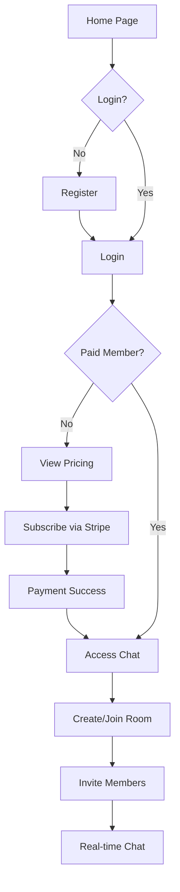

## 1. Product Overview
RowWhisper is a private office chat SaaS platform for overseas teams, providing secure encrypted communication without social features. Users subscribe via Stripe to create private chat rooms for team collaboration.
- Main purpose: Secure private team communication for overseas businesses
- Target users: Remote teams, international companies, freelancers working with overseas clients
- Market value: Privacy-focused business communication tool avoiding public social distractions

## 2. Core Features

### 2.1 User Roles
| Role | Registration Method | Core Permissions |
|------|---------------------|------------------|
| Free User | Email registration | Register, login, view pricing |
| Paid Member | Email registration + Stripe subscription | Create rooms, invite members, send messages |
| Room Admin | Room creator | Manage room members, delete room |

### 2.2 Feature Modules
1. **Static Website**: Home page, Pricing page, Privacy Policy page, Contact page
2. **Account System**: Registration, Login, Password recovery
3. **Subscription System**: Monthly/Yearly plans, Stripe payment, Subscription management
4. **Chat System**: Create room, Invite members, Real-time messaging, Room management

### 2.3 Page Details
| Page Name | Module Name | Feature description |
|-----------|-------------|---------------------|
| Home | Hero Section | Main value proposition, CTA buttons |
| Home | Features | Secure encryption, Private rooms, Team collaboration |
| Home | Footer | Links to pricing, privacy, contact |
| Pricing | Plans | Monthly/Yearly subscription plans with Stripe payment |
| Privacy Policy | Content | Privacy terms, data protection, user rights |
| Contact | Form | Contact us form with email submission |
| Register | Form | Email registration with password |
| Login | Form | Email login with password |
| Member Center | Dashboard | Subscription status, room list, profile |
| Chat | Room List | List of joined rooms with unread counts |
| Chat | Room View | Real-time messaging, member list, invite members |

## 3. Core Process

### 3.1 Registration Flow
User → Email registration → Verify email → Login → View pricing → Subscribe via Stripe → Access chat features

### 3.2 Subscription Flow
User → Select plan → Stripe checkout → Payment success → Webhook notification → Activate subscription → Access premium features

### 3.3 Chat Flow
Member → Create room → Invite members → Send messages → Real-time delivery → View message history

### 3.4 Flowchart

## 4. User Interface Design

### 4.1 Design Style
- Primary color: Deep navy blue (#0F172A) - professional, trustworthy
- Secondary color: Emerald green (#10B981) - success, secure
- Accent color: Slate gray (#475569) - neutral, clean
- Background: Light gray (#F8FAFC) - clean, minimal
- Button style: Rounded corners (8px), flat design, hover shadows
- Font: Inter (sans-serif) - modern, professional
- Layout: Card-based, clean whitespace, left-to-right flow
- Icons: Lucide React - minimal, consistent

### 4.2 Page Design Overview
| Page Name | Module Name | UI Elements |
|-----------|-------------|-------------|
| Home | Hero | Large headline, subtext, CTA buttons (primary/secondary), decorative background gradient |
| Home | Features | 3 feature cards with icons, titles, descriptions |
| Home | Footer | Links row, copyright text, 18+ Only badge |
| Pricing | Plans | 2 pricing cards (monthly/yearly), feature list, Stripe payment button |
| Privacy | Content | Scrollable text content, header, footer |
| Contact | Form | Input fields (name, email, message), submit button |
| Register/Login | Form | Email/password fields, submit button, link to other page |
| Member Center | Dashboard | Subscription status badge, room list cards, profile section |
| Chat | Room List | Sidebar with room list, unread badges |
| Chat | Room View | Message area, input field, member sidebar |

### 4.3 Required Labels
All pages must display:
- 18+ Only
- No Stranger Matching
- Private Office Chat Only

### 4.4 Responsiveness
- Desktop-first approach
- Mobile adaptive: Stacked layout on small screens
- Touch optimization for mobile buttons and inputs

### 4.5 Accessibility
- Semantic HTML structure
- Color contrast ratio ≥ 4.5:1
- Keyboard navigation support
- ARIA labels for screen readers
